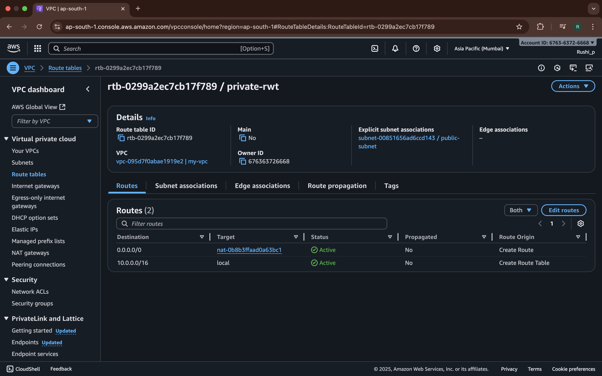

# 3-Tier Architecture on AWS

This project demonstrates the deployment of a **3-Tier Web Application Architecture** on **Amazon Web Services (AWS)**.  
It includes the **Presentation Layer (Web Tier)**, **Application Layer**, and **Database Layer**, hosted in a custom **VPC** with secure networking, auto-scaling, and load balancing.

---

## 📌 Architecture Overview

- **Tier 1 – Web Layer**: Public Subnet, EC2 instance (`node-server`) for frontend (Node.js or similar).
- **Tier 2 – Application Layer**: Private Subnet, EC2 instance (`app-server`) for backend processing.
- **Tier 3 – Database Layer**: Private Subnet, EC2 instance (`db-server`) for database.
- **Networking**: Custom VPC with Internet Gateway, NAT Gateway, Route Tables, and Security Groups.

---

## 🚀 Steps to Deploy

### 1️⃣ Create a Custom VPC

- Create a **VPC** with CIDR block (e.g., `10.0.0.0/16`).
- Enable **DNS hostname and DNS resolution**.

### 2️⃣ Create Subnets

- **1 Public Subnet** (for `node-instance`).
- **2 Private Subnets** (for `app-server` and `db-server`).
- Place subnets across **multiple Availability Zones (AZs)** for high availability.

### 3️⃣ Configure Networking Components

- **Internet Gateway (IGW)** → Attach to the VPC for internet access.
- **NAT Gateway** → Place in the Public Subnet to allow private subnets outbound internet access.
- **Route Tables**:  
  - Public Route Table → Route `0.0.0.0/0` to IGW.
  - Private Route Table → Route `0.0.0.0/0` to NAT Gateway.

### 4️⃣ Configure Security Groups & NACLs

- **Node SG**: Allow HTTP(80), HTTPS(443) from anywhere, SSH(22) from your IP.
- **App SG**: Allow traffic only from Node SG.
- **DB SG**: Allow database port (e.g., 3306 for MySQL, 5432 for PostgreSQL) only from App SG.

### 5️⃣ Launch EC2 Instances

- Launch **`node-instance`** in the Public Subnet for the Web Tier.
- Launch **`app-server`** in a Private Subnet for the Application Tier.
- Launch **`db-server`** in a Private Subnet for the Database Tier.
- Attach appropriate **Security Groups**.
- Install required software (Node.js, backend application, database, etc.).

### 6️⃣ (Optional) Configure Load Balancer & Auto Scaling

- If needed, create an **Application Load Balancer (ALB)** in the Public Subnet and register the `node-instance`.
- Configure **Auto Scaling Group (ASG)** for the Web/App EC2 instances.

### 7️⃣ Test the Setup

- Access the application using the **public IP or DNS** of the `node-instance` (or ALB if used).
- Verify traffic flow:
  - User → Node Instance (Web Tier, Public) → App Server (Private) → DB Server (Private).

---

## 🛠️ Tools & Services Used

- **VPC, Subnets, Route Tables, Internet Gateway, NAT Gateway**
- **EC2 (`node-server`, `app-server`, `db-server`)**
- **(Optional) Application Load Balancer**
- **(Optional) Auto Scaling Group**
- **IAM Roles & Security Groups**

---

## 📂 Project Use Case

This architecture is commonly used in **production-grade web applications** to ensure:

- **Scalability** via Auto Scaling.
- **High Availability** via Multi-AZ deployment.
- **Security** via isolated subnets and security group rules.

---

## 📸 Architecture Diagram

---

## 📌 Author

Developed by **Rushikesh Panchal** – Cloud/DevOps Engineer 🚀
